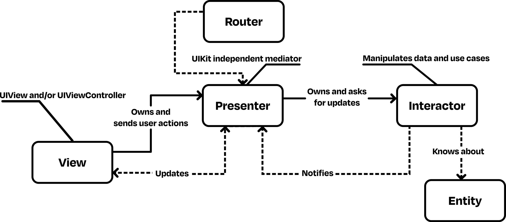

# Project Tech Stack

- **Xcode Version**: 15.3
- **Language**: Swift 5.10
- **Minimum iOS Version**: 15.0
- **Design Pattern**: VIPER
- **Dependency Manager**: Swift Package Manager
- **Package Dependencies**: Moya, SDWebImage, Alamofire, Realm, RxSwift
- **Made with**: ❤️

## Some Highlighted Things

- ✅ Unit Test
- ✅ Programmatic Design
- ✅ Compositional Layout
- ✅ Notification Manager
- ✅ Custom Views
- ✅ Readability
- ✅ Organized Folder Structure
- ✅ Following Same Style in Every File

# VIPER Architecture

## Nice to Have

- Modularity
- Combine
- UICollectionViewDiffableDataSource

# Getir Shopping App - Simple Shopping Solution

The Getir Shopping App is a streamlined, intuitive shopping application designed to mimic the core functionalities of the popular Getir app, with a focus on simplicity and performance. The app showcases a clean design inspired by Getir's UI/UX, ensuring a familiar and user-friendly experience.

## Key Features

- **Product Listing**: Users can view a list of products fetched from a mock API, displayed in both horizontal and vertical scrollable lists. 

- **Product Detail**: Clicking on any product item takes the user to a detailed page where they can see an enlarged image, name, price, and description of the product.

- **Shopping Cart**: Users can add or remove products to/from their cart, view the total amount, and checkout with a success message displaying the total cost.

## Technical Highlights

- **Language**: Swift
- **Architecture**: VIPER is employed as the architectural pattern, establishing a clear separation of concerns. It breaks down the app into distinct layers, each with a single responsibility, enhancing the maintainability and scalability of the codebase.
- **Design Patterns**: Emphasis on separation of concerns with the use of design patterns.
- **UI Design**: Follows Figma designs provided, inspired by the Getir app.
- **Layout**: Implemented using Compositional Layout for a modern and flexible UI.
- **No Storyboards/Xibs**: UI is coded programmatically for precise control and customization.
- **Custom Views**: Custom views are utilized to encapsulate the UI elements, promoting reusability and testability. This approach keeps the UI code clean and modular, making it easier to manage and update.
- **Notification Manager**: A robust communication mechanism implemented to listen for events across different parts of the app, such as adding or removing items from the cart on various screens. This ensures that all views are updated in real time, providing a seamless and responsive user experience. Utilizing a Notification Manager helps in maintaining a synchronized state throughout the application, especially when the same data is manipulated in multiple views, such as the main page, detail page, and shopping cart.

## Functional Requirements

- The app strictly adheres to the functional requirements as laid out, ensuring proper data display, navigation, cart management, and synchronization after returning from different screens.

## Additional Information

- The project is fully compatible with Xcode 15.0 and is production-ready.
- Code quality is maintained with clean, maintainable, and well-documented practices.
- Git is utilized effectively to showcase proper version control practices.
- A modular approach is adopted where feasible, enhancing readability and maintainability.
